# Vistara

> **See it. Remember it. Ask later.**
>
> Vistara turns live camera feeds into searchable visual memories you can talk to.

Vistara is a multi-user, multi-camera **visual memory system**. It continuously observes connected cameras, uses a lightweight local change gate to avoid unnecessary inference, sends meaningful temporal context to an open-weight vision model, converts what it sees into structured semantic memory, and lets users recover those memories through natural-language questions.

The core idea is simple:

```text
The camera saw it.
Vistara remembered it.
You can ask later.
```

Vistara is intentionally **memory-first rather than archive-first**. It does not need to turn every camera frame into a searchable database. Instead, it builds a semantic timeline of scenes, objects, states, events, and visual evidence, while preserving selected evidence snapshots for important observations.

---

## Contents

- [What Vistara Does](#what-vistara-does)
- [Why Vistara Exists](#why-vistara-exists)
- [Core Product Loop](#core-product-loop)
- [What Makes It Different](#what-makes-it-different)
- [Architecture at a Glance](#architecture-at-a-glance)
- [Locked Technology Stack](#locked-technology-stack)
- [AI Model Responsibilities](#ai-model-responsibilities)
- [Camera Connectivity](#camera-connectivity)
- [Camera Reliability](#camera-reliability)
- [Visual Perception](#visual-perception)
- [Memory Model](#memory-model)
- [Retrieval and RAG](#retrieval-and-rag)
- [Chat and Agent](#chat-and-agent)
- [Evidence Snapshots](#evidence-snapshots)
- [Security and Privacy](#security-and-privacy)
- [Frontend](#frontend)
- [Backend](#backend)
- [Database](#database)
- [API and WebSocket Contracts](#api-and-websocket-contracts)
- [End-to-End Flows](#end-to-end-flows)
- [Repository Layout](#repository-layout)
- [Setup](#setup)
- [Environment Variables](#environment-variables)
- [Supabase Setup](#supabase-setup)
- [Groq Setup](#groq-setup)
- [Running the Backend](#running-the-backend)
- [Running in Mock Mode](#running-in-mock-mode)
- [Testing](#testing)
- [Current Verification State](#current-verification-state)
- [Current Limitations](#current-limitations)
- [Hackathon Demo](#hackathon-demo)
- [Open-Source AI Compliance](#open-source-ai-compliance)
- [Roadmap](#roadmap)
- [Design Principles](#design-principles)
- [What Vistara Is Not](#what-vistara-is-not)
- [Contributing](#contributing)
- [License](#license)

---

# What Vistara Does

Vistara turns a stream of visual observations into a structured, searchable memory.

A camera may see:

- a development board moved from the middle of a desk to the side of a laptop;
- a bottle that appeared and later disappeared;
- a notebook that changed position;
- a desk whose activity changed;
- a particular object being present at a particular point in time.

Instead of requiring the user to manually scan hours of footage, Vistara stores a semantic representation of the observation and allows later questions such as:

> **“Where was the ESP32 before I moved it?”**

> **“What changed in the last minute?”**

> **“When did the bottle appear?”**

> **“Show me.”**

The final question can lead from a semantic answer to the evidence snapshot associated with the relevant memory/event.

---

# Why Vistara Exists

Traditional cameras are excellent at **recording**, but recording and remembering are different problems.

A normal camera gives you a timeline of pixels. Vistara tries to give you a timeline of **meaning**.

The user should not have to remember:

- an exact timestamp;
- which camera saw an event;
- whether an object was slightly left or right of something;
- which part of a long recording contained the change.

Vistara instead builds a searchable semantic history and exposes that history through natural language.

---

# Core Product Loop

```text
                 LIVE CAMERA
                      │
                      ▼
             MEANINGFUL CHANGE
                      │
                      ▼
           MULTI-FRAME OBSERVATION
                      │
                      ▼
             SEMANTIC MEMORY
                      │
                      ▼
       NATURAL-LANGUAGE RETRIEVAL
                      │
                      ▼
             ANSWER + EVIDENCE
```

The system deliberately does **not** call an expensive VLM continuously on every frame.

---

# What Makes It Different

## 1. Semantic compression first

Instead of treating raw video as the primary searchable knowledge base, Vistara turns meaningful observations into structured memories.

## 2. Temporal context instead of one-frame guessing

When a meaningful change happens, Vistara uses frames from before, during, and after the change. This helps the vision model distinguish movement, appearance, disappearance, occlusion, and state changes.

## 3. Multiple model roles

The system deliberately separates visual perception, semantic indexing, and language reasoning rather than asking one model to do everything.

## 4. Camera-source abstraction

Browser cameras, phones, RTSP cameras, ONVIF-discovered devices, NVR channels, HLS, and MJPEG can converge into one normalized processing pipeline.

## 5. Natural-language memory retrieval

The user does not need to know database fields or camera timestamps. GPT-OSS can choose retrieval tools and reason over the returned memories.

## 6. Evidence attached to memory

A semantic result can be linked back to the visual snapshot that produced it.

---

# Architecture at a Glance

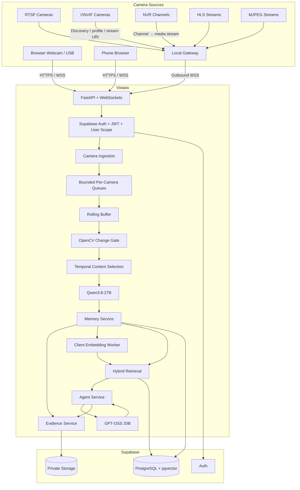

---

# Locked Technology Stack

| Layer | Technology |
|---|---|
| Frontend | Next.js, TypeScript, App Router, Tailwind, shadcn/ui, Lucide |
| Browser camera | `getUserMedia()` + WebSocket / secure WSS |
| Backend | Python 3.12, FastAPI, Pydantic, asyncio, WebSockets |
| Local CV | OpenCV frame difference, persistence, cooldown, optional SSIM |
| Vision | **Qwen3.8-27B via Groq** — `qwen/qwen3.8-27b` |
| Chat / Agent | **GPT-OSS 20B via Groq** — `openai/gpt-oss-20b` |
| Embeddings | **Qwen3-Embedding-0.6B**, client-side via Transformers.js + ONNX + WebGPU |
| Database | Supabase PostgreSQL |
| Vector search | pgvector, 1024-dimensional vectors |
| Authentication | Supabase Auth + backend JWT validation |
| Storage | Private Supabase Storage bucket for production evidence |
| Development fallback | Local SQLite + local evidence directory / mock providers |
| Camera gateway | Local outbound-only gateway for LAN camera sources |
| Media tooling | FFmpeg for RTSP/HLS where needed |

### Explicitly not part of the locked MVP architecture

- No Ollama
- No local VLM
- No Firestore
- No Redis
- No Celery
- No Kafka
- No Qdrant
- No Pinecone
- **No FastVLM-0.5B in the MVP**

FastVLM was considered as a lightweight second visual model. The project deliberately chose **multi-frame contextual perception with Qwen3.8-27B** instead: it keeps browser/model complexity lower while giving the main VLM better temporal evidence.

---

# AI Model Responsibilities

The model stack is intentionally role-separated.

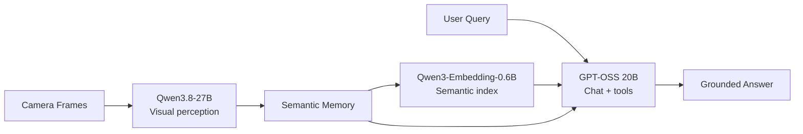

## Qwen3.8-27B — “the eyes”

The authoritative visual model.

Responsibilities:

- scene understanding;
- overall scene summary;
- object inventory;
- object attributes when visually supported;
- object state;
- approximate location;
- relationships;
- events and deltas;
- structured JSON validated by Pydantic.

## Qwen3-Embedding-0.6B — “the search index”

A client-side embedding model running through Transformers.js, ONNX and WebGPU.

It embeds:

- retrieval-oriented memory text;
- user search queries.

It does **not** embed raw video.

The embedding is an index. The structured PostgreSQL memory remains the source of truth.

## GPT-OSS 20B — “the brain”

The conversational and tool-using layer.

Responsibilities:

- interpret the user's question;
- choose retrieval tools;
- combine temporal, object, event, metadata and vector results;
- request evidence when useful;
- produce a grounded natural-language answer.

GPT-OSS is deliberately not responsible for interpreting the live camera feed.

---

# Camera Connectivity

Vistara is designed as a multi-source camera platform rather than a single webcam application.

## Supported source families

| Source | Role | Transport / mechanism |
|---|---|---|
| Browser webcam / USB | Direct browser camera | `getUserMedia()` + WSS |
| Phone camera | Browser camera paired through QR | HTTPS + WSS |
| RTSP camera | Network/IP camera | RTSP, normally through local gateway |
| ONVIF camera | Discovery/control | ONVIF → media profile → RTSP |
| NVR | Multiple logical channels | Usually RTSP per channel |
| HLS | Network media stream | HLS / FFmpeg |
| MJPEG | Multipart JPEG stream | HTTP multipart MJPEG |
| Local gateway | LAN bridge | Outbound secure WSS |

## Source abstraction

Every source converges into the same internal processing pipeline.

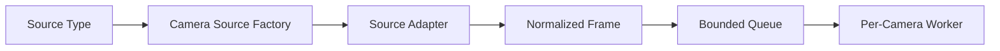

The perception layer should not need to know whether a frame came from a phone, browser webcam, NVR channel, RTSP camera, or MJPEG source.

---

# Browser and USB Camera Flow

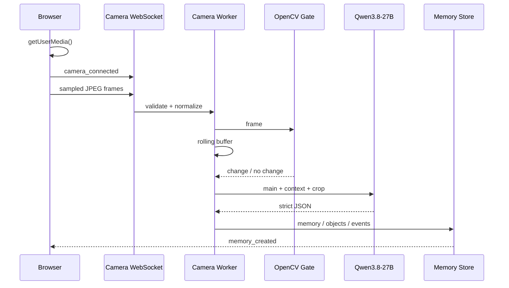

The browser keeps its own local preview. Frames do not need to be streamed back from the backend.

---

# Phone Camera Pairing

The phone path is browser-based; no native mobile application is required for the MVP.

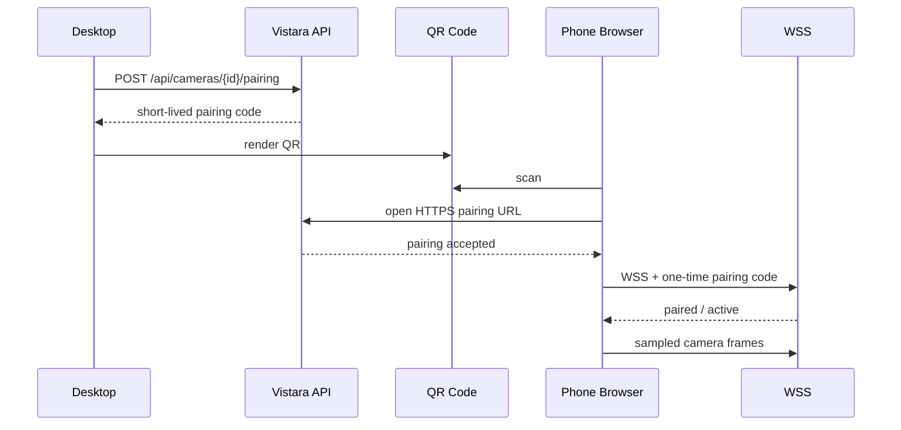

Pairing properties:

- short-lived;
- camera-scoped;
- user-scoped;
- single-use / replay-safe;
- revocable;
- no long-lived secret embedded in the QR code.

---

# Local Gateway for CCTV / NVR / LAN Cameras

Random user LAN cameras should not require their RTSP port to be exposed to the public internet.

The preferred architecture is an outbound-only local gateway.

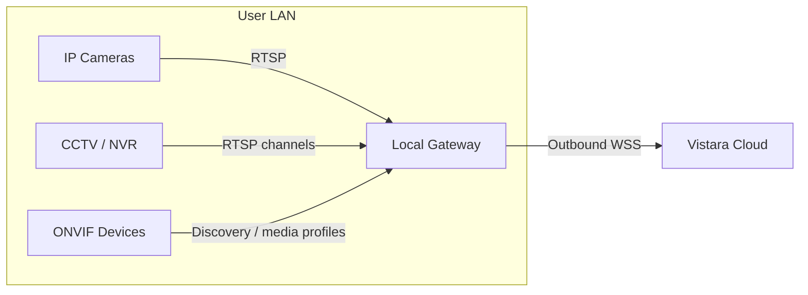

The gateway can handle:

- ONVIF discovery;
- RTSP connection;
- HLS / MJPEG ingestion where relevant;
- decoding / normalization;
- local frame sampling;
- local health checks;
- secure outbound delivery to Vistara.

The gateway does **not** require inbound public connectivity to the user's LAN.

---

# Camera Reliability

Each camera is independently managed and isolated.

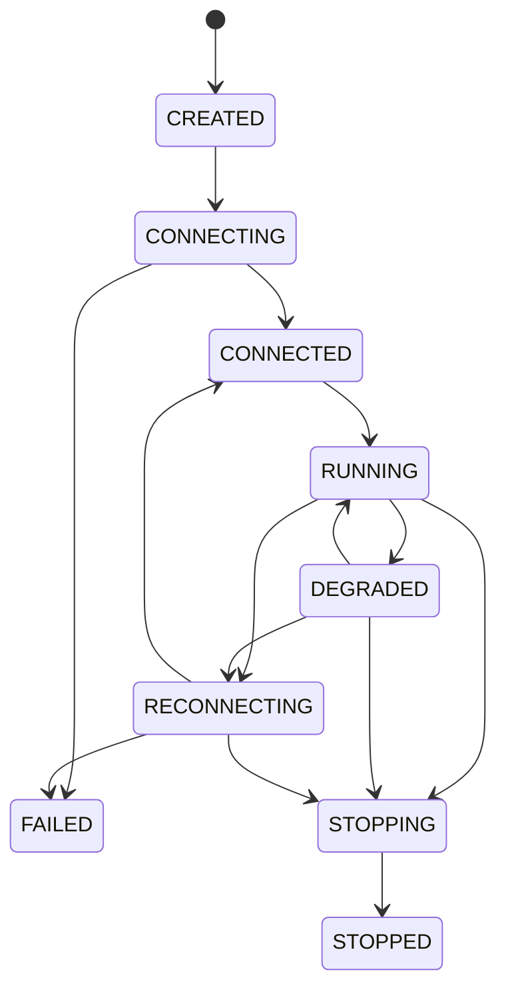

### Reliability features

- per-camera worker isolation;
- bounded per-camera frame queues;
- drop-oldest under pressure;
- dropped-frame accounting;
- stale-source detection;
- bounded exponential reconnect with jitter;
- cleanup before reconnect;
- FFmpeg process cleanup;
- structured lifecycle events;
- a broken camera does not crash other cameras.

### Health is more than “connected”

Health tracks:

- current lifecycle state;
- last frame received;
- last successful read/decode;
- reconnect count;
- frames received;
- frames dropped;
- last error;
- source type.

A live TCP connection with no frames is a degraded camera, not a healthy camera.

---

# Visual Perception

## The key design choice: multi-frame context

Vistara does **not** send a single isolated trigger frame to Qwen3.8-27B.

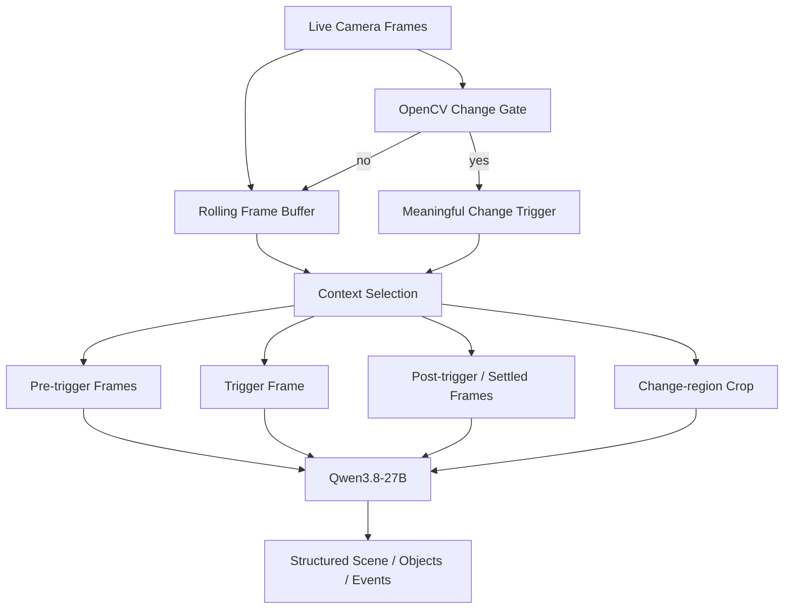

A typical event context is conceptually:

```text
BEFORE                  TRIGGER                 AFTER
────────                ───────                 ─────
frame -3s               changed frame           frame +1s
frame -2s               event frame             frame +2s
frame -1s               main frame              settled state
```

This helps the model answer questions such as:

- what was there before?
- what appeared?
- what disappeared?
- what moved?
- what changed state?
- what merely became visible after being occluded?

## OpenCV gate

The gate is deliberately cheap.

It can use:

- downsampled grayscale difference;
- thresholding;
- persistence;
- cooldown;
- optional SSIM.

It exists to avoid waking a large VLM for every incoming frame.

## Why not FastVLM?

FastVLM-0.5B was considered as a client-side visual inventory pass. It was intentionally excluded from the MVP because it would add:

- another model download;
- additional WebGPU pressure;
- another inference pipeline;
- additional latency and failure modes;
- extra frontend complexity.

The preferred visual-quality lever is **better temporal evidence**: multi-frame context + change-region crops + a strong VLM.

---

# Qwen3.8-27B Perception Contract

The vision model is asked to produce three conceptual layers of information.

## Scene

- scene type;
- concise summary;
- current activity;
- environment.

## Objects / states

For each useful object, when supported:

- label/category;
- description;
- color;
- material;
- state;
- approximate location;
- relationships;
- confidence.

### Important rule

**A missing attribute is better than a fabricated attribute.**

For example:

```json
{
  "label": "bottle",
  "attributes": {
    "color": "blue",
    "material": "plastic"
  },
  "location": "left side of desk"
}
```

If a color or material is not visually supported, it should not be invented just to satisfy a schema.

## Events / deltas

MVP event types include:

- `OBJECT_APPEARED`
- `OBJECT_DISAPPEARED`
- `OBJECT_MOVED`
- `SCENE_CHANGED`
- activity changes where supported.

The model is prompted to perform a **visual inventory** and a second verification pass instead of returning a generic caption.

---

# Memory Model

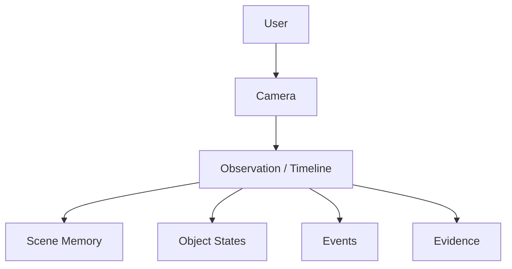

The semantic memory hierarchy is:

```text
USER
  └── CAMERA
       └── TIMELINE / OBSERVATION
            ├── SCENE
            ├── OBJECT STATES
            ├── EVENTS
            └── EVIDENCE
```

## Example: object history

```text
ESP32

10:41 → center of desk
10:43 → beside laptop
10:47 → right side of desk
11:02 → last observed
```

“Last observed” is intentionally not phrased as “definitely removed”. An object may have been hidden, occluded, or missed by later observations.

## Source of truth vs index

```text
PostgreSQL structured memory
        │
        └── SOURCE OF TRUTH

pgvector embedding
        │
        └── SEARCH INDEX
```

Embeddings help find memories. They are not themselves the memory.

---

# Retrieval and RAG

Vistara uses **hybrid retrieval**, not vector search alone.

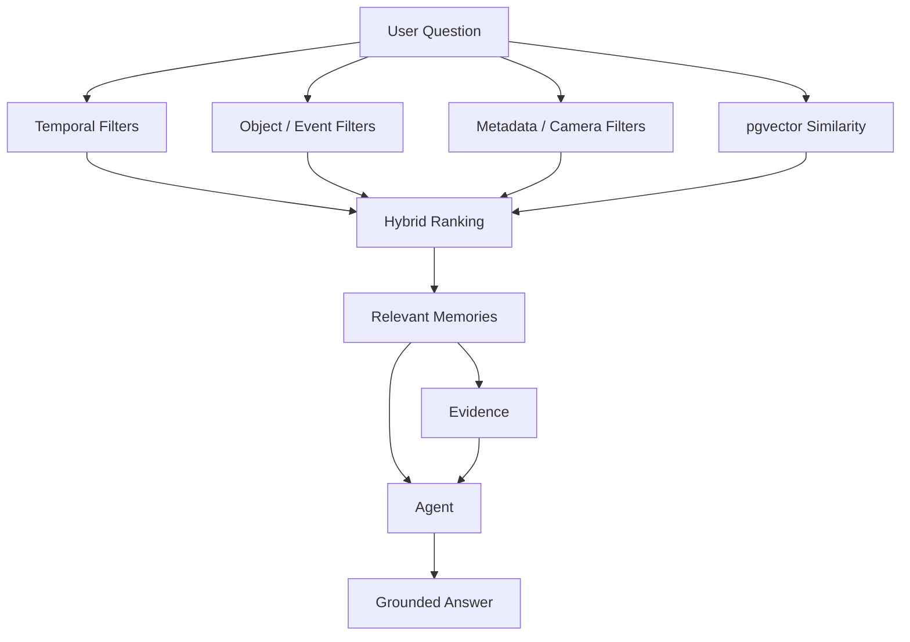

Examples:

| Question | Best retrieval path |
|---|---|
| “What changed in the last minute?” | Time + event filters |
| “Where was the ESP32?” | Object history + temporal reasoning |
| “When did the bottle appear?” | Event search |
| “That little development board” | Semantic/vector similarity + object metadata |
| “Show me.” | Evidence retrieval |

---

# Client-Side Embeddings

The chosen semantic indexing model is:

**Qwen3-Embedding-0.6B**

Runtime:

- Transformers.js
- ONNX
- WebGPU
- Web Worker

```mermaid
flowchart LR
    M[Memory Created]
    TXT[Retrieval-Oriented Memory Text]
    W[Web Worker]
    E[Qwen3-Embedding-0.6B]
    V[1024-D Vector]
    API[POST /api/memories/{id}/embedding]
    DB[(pgvector)]

    M --> TXT --> W --> E --> V --> API --> DB
```

Embedding generation is asynchronous. Memory persistence must not wait for the browser to finish embedding.

If WebGPU is unavailable, Vistara should still support:

- exact metadata retrieval;
- temporal retrieval;
- object history;
- event search.

Vector similarity is an enhancement, not the only retrieval path.

---

# Chat and Agent

GPT-OSS 20B handles natural-language reasoning and tool use.

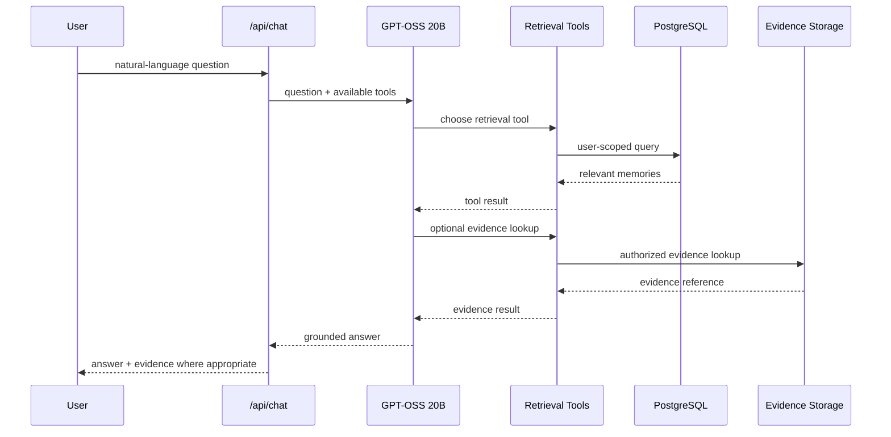

The model does not receive the complete raw camera stream.

The backend controls:

- tool definitions;
- user scoping;
- database access;
- evidence access;
- termination of the tool loop.

---

# Evidence Snapshots

Vistara keeps the distinction between **what the camera supplied** and **what a model inferred**.

When a meaningful event is created, Vistara can store a selected visual evidence snapshot associated with that memory/event.

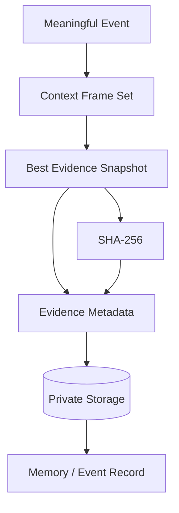

### Evidence metadata can include

- memory/event ID;
- camera ID;
- capture timestamp;
- frame sequence where available;
- image dimensions;
- encoding information;
- private storage path;
- SHA-256 content hash.

### Important limitation

Vistara is **not claiming legal or forensic chain of custody**.

A hash proves that the stored bytes match the hashed bytes. It does not prove that the camera clock was perfect, that the camera source was uncompromised, or that the image is legally admissible evidence.

The correct product wording is:

> **“A visual evidence snapshot associated with this memory.”**

---

# Security and Privacy

Vistara deals with cameras, which makes security a first-class concern.

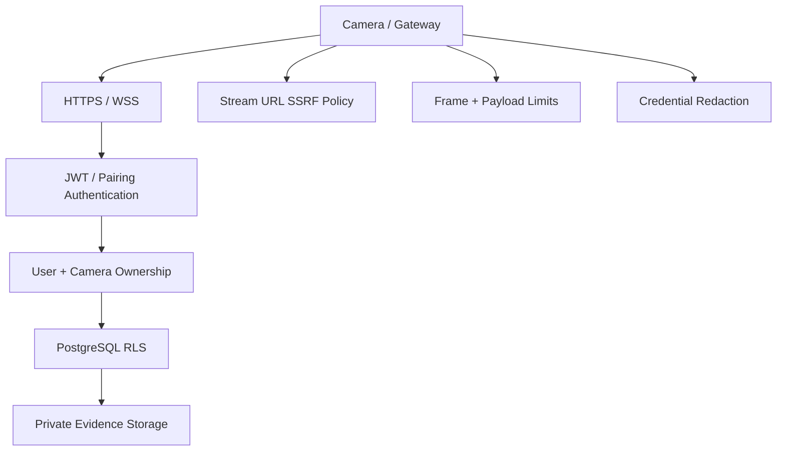

## Core controls

- JWT authentication;
- user-scoped repositories;
- database-side RLS in production;
- private evidence bucket;
- short-lived phone pairing codes;
- single-use/replay-safe pairing;
- camera ownership checks;
- bounded frame sizes;
- credential-bearing URL redaction;
- SSRF protection for remote stream URLs;
- graceful failure instead of silent authorization bypass.

## Camera URL security

User-controlled RTSP/HLS URLs are untrusted input.

Default policy should reject loopback/private/metadata destinations unless explicitly enabled for a self-hosted LAN deployment.

Configuration gate:

```dotenv
CAMERAS_ALLOW_PRIVATE_NETWORKS=true
```

Credential-bearing URLs must never appear unredacted in logs or API responses.

---

# Frontend

The frontend is a separate application and is intentionally not mixed into the backend package.

The frontend stack is:

- Next.js;
- TypeScript;
- App Router;
- Tailwind CSS;
- shadcn/ui;
- Lucide;
- browser Media APIs;
- WebSockets;
- Web Worker;
- Transformers.js;
- ONNX;
- WebGPU.

## Frontend responsibilities

The frontend owns:

- authentication UI;
- camera preview;
- browser/phone camera capture;
- QR pairing UI;
- memory timeline;
- object history UI;
- event browsing;
- evidence display;
- chat interface;
- client-side Qwen3-Embedding-0.6B worker.

The frontend does **not** own:

- GPT-OSS reasoning;
- database authorization;
- memory truth;
- evidence authorization;
- agent tool execution.

## Frontend contract

`docs/FRONTEND_PLAN.md` is the frozen integration contract.

The backend currently exposes the planned contract surface as:

- **9 REST endpoints**;
- **6 WebSocket message types**;
- **7 agent tools**.

The frontend should consume these contracts rather than reverse-engineering backend internals.

---

# Backend

The backend is implemented in Python 3.12 with FastAPI, Pydantic, asyncio and WebSockets.

Its main responsibilities are:

1. authenticate users;
2. manage camera sources;
3. normalize incoming frames;
4. apply the local change gate;
5. maintain temporal context;
6. invoke Qwen3.8-27B when needed;
7. persist semantic memories;
8. store evidence;
9. expose retrieval tools;
10. run the GPT-OSS agent loop;
11. expose stable REST/WebSocket contracts;
12. keep user and camera scope enforced.

---

# Database

Production storage is Supabase:

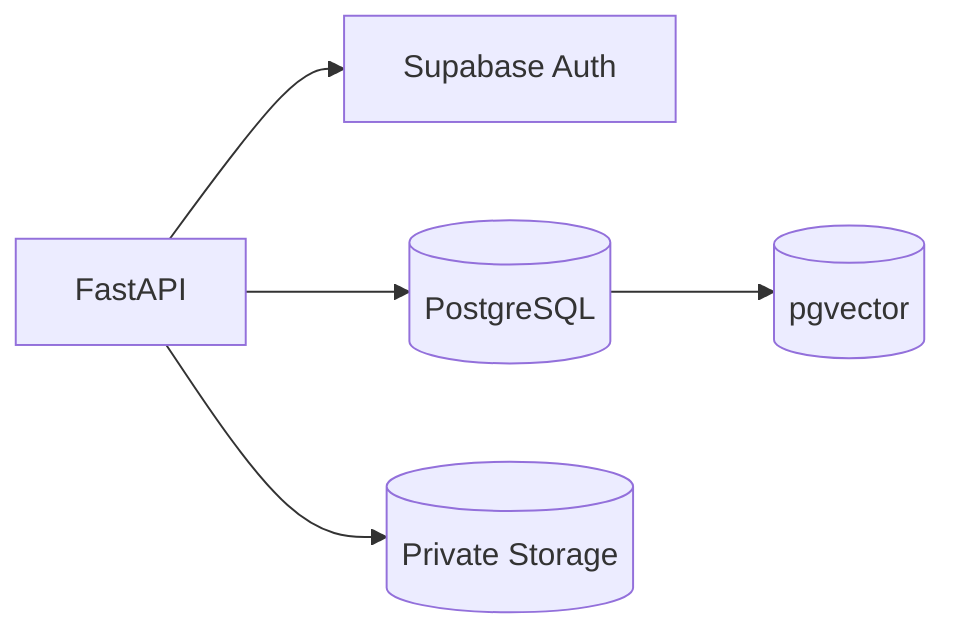

The initialization migration is expected to provide:

- core application tables;
- foreign keys;
- indexes;
- pgvector;
- `vector(1024)` storage;
- RLS;
- own-row policies;
- private evidence bucket configuration.

A local SQLite configuration is a development fallback only. It cannot verify production RLS, pgvector, or Supabase Storage behavior.

---

# API and WebSocket Contracts

## REST surface

The current backend contract includes these domain areas:

- health;
- cameras;
- memories;
- objects;
- events;
- chat;
- evidence;
- ingestion;
- pairing / gateway / discovery where applicable.

The exact request/response shapes are defined by the backend OpenAPI schema and `docs/FRONTEND_PLAN.md`.

## WebSocket camera protocol

### Client → server

```json
{"type":"camera_connected"}
```

```json
{"type":"frame","data":"<base64 jpeg>","ts":1730000000000}
```

```json
{"type":"stop"}
```

### Server → client

```json
{"type":"connection_state","state":"connected"}
```

```json
{"type":"processing","state":"analyzing"}
```

```json
{"type":"change_detected","score":0.031}
```

```json
{"type":"memory_created","memory_id":"...","summary":"...","events":[]}
```

```json
{"type":"error","message":"..."}
```

The frontend keeps its own live preview. The backend does not need to stream preview frames back.

---

# End-to-End Flows

## Camera → memory

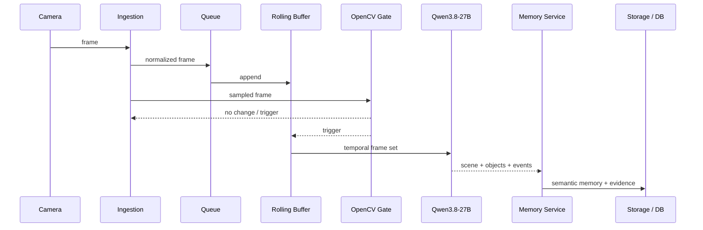

## Memory → embedding

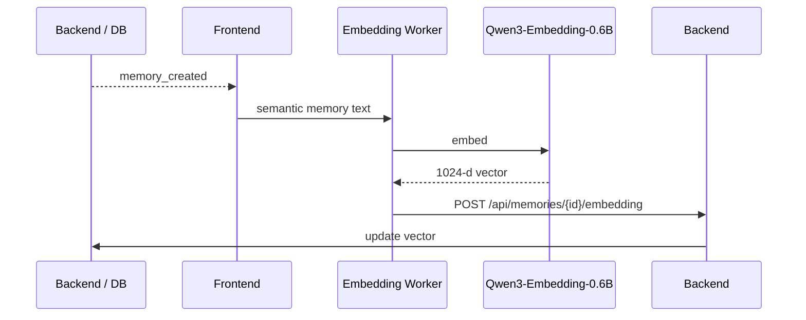

## Chat → answer

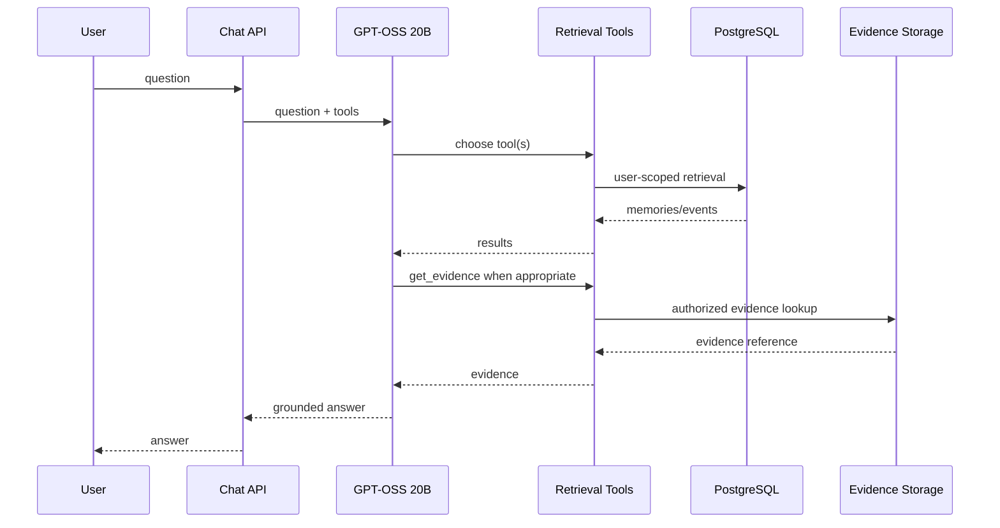

---

# Repository Layout

```text
.
├── README.md
├── AGENTS.md
├── ARCHITECTURE.md
├── IMPLEMENTATION.md
├── PLAN.md
├── TASK.md
├── Makefile
├── .env.example
├── pytest.ini
│
├── backend/
│   ├── app/
│   │   ├── api/
│   │   │   ├── health.py
│   │   │   ├── cameras.py
│   │   │   ├── memories.py
│   │   │   ├── objects.py
│   │   │   ├── events.py
│   │   │   ├── chat.py
│   │   │   ├── evidence.py
│   │   │   ├── ws.py
│   │   │   ├── ingest.py
│   │   │   ├── pairing.py
│   │   │   ├── gateway.py
│   │   │   └── discovery.py
│   │   │
│   │   ├── core/
│   │   │   ├── config.py
│   │   │   ├── security.py
│   │   │   └── logging.py
│   │   │
│   │   ├── db/
│   │   │   ├── models.py
│   │   │   ├── repositories.py
│   │   │   └── session.py
│   │   │
│   │   ├── cameras/
│   │   │   ├── base.py
│   │   │   ├── factory.py
│   │   │   ├── frames.py
│   │   │   ├── security.py
│   │   │   ├── reconnect.py
│   │   │   ├── pull.py
│   │   │   ├── ffmpeg_reader.py
│   │   │   ├── rtsp.py
│   │   │   ├── hls.py
│   │   │   ├── mjpeg.py
│   │   │   ├── onvif.py
│   │   │   ├── nvr.py
│   │   │   ├── pairing.py
│   │   │   ├── gateway.py
│   │   │   └── manager.py
│   │   │
│   │   ├── perception/
│   │   │   ├── gate.py
│   │   │   ├── buffer.py
│   │   │   ├── pipeline.py
│   │   │   └── image_utils.py
│   │   │
│   │   ├── providers/
│   │   │   ├── vision.py
│   │   │   ├── groq_qwen38.py
│   │   │   ├── chat.py
│   │   │   ├── groq_gptoss.py
│   │   │   └── mock.py
│   │   │
│   │   ├── memory/
│   │   │   ├── schemas.py
│   │   │   ├── service.py
│   │   │   ├── normalization.py
│   │   │   └── serialize.py
│   │   │
│   │   ├── retrieval/
│   │   │   ├── service.py
│   │   │   └── hybrid.py
│   │   │
│   │   ├── agent/
│   │   │   ├── service.py
│   │   │   ├── tools.py
│   │   │   └── prompts.py
│   │   │
│   │   ├── evidence/
│   │   │   └── service.py
│   │   │
│   │   └── workers/
│   │       ├── camera_worker.py
│   │       └── embedding.py
│   │
│   └── tests/
│       ├── unit / offline tests
│       └── integration/
│
├── supabase/
│   └── migrations/
│       └── 0001_init.sql
│
├── scripts/
│   ├── doctor.py
│   ├── verify_supabase.py
│   └── ws_smoke.py
│
└── docs/
    └── FRONTEND_PLAN.md
```

---

# Setup

## Prerequisites

- Python 3.12+;
- a Supabase project for production-backed mode;
- a Groq API key;
- FFmpeg for RTSP/HLS sources;
- a browser with camera support for browser/phone capture.

Python 3.11 may work; the existing development environment has also been tested with Python 3.13, but Python 3.12 is the locked target.

---

## Python environment

### Windows PowerShell

```powershell
python -m venv .venv
.venv\Scripts\Activate.ps1
pip install -r backend/requirements.txt
```

### macOS / Linux

```bash
python -m venv .venv
source .venv/bin/activate
pip install -r backend/requirements.txt
```

---

# Environment Variables

Start from the example:

```bash
# Windows
copy .env.example .env

# macOS / Linux
cp .env.example .env
```

Typical variables include:

```dotenv
# Groq
GROQ_API_KEY=...
GROQ_VLM_MODEL=qwen/qwen3.8-27b
GROQ_CHAT_MODEL=openai/gpt-oss-20b
GROQ_VLM_REASONING_EFFORT=low

# Supabase
SUPABASE_URL=...
SUPABASE_ANON_KEY=...
SUPABASE_SERVICE_ROLE_KEY=...
SUPABASE_JWT_SECRET=...
SUPABASE_EVIDENCE_BUCKET=evidence
DATABASE_URL=...

# Camera security
CAMERAS_ALLOW_PRIVATE_NETWORKS=false

# Optional development mode
MOCK_MODE=false
```

### Secrets

Never expose or commit:

- `GROQ_API_KEY`;
- `SUPABASE_SERVICE_ROLE_KEY`;
- `SUPABASE_JWT_SECRET`;
- credential-bearing camera URLs.

The service role key and JWT secret belong on the backend only.

---

# Supabase Setup

## 1. Create a project

Create a Supabase project and obtain:

- Project URL;
- anon key;
- service-role key;
- JWT secret;
- PostgreSQL connection string.

## 2. Configure environment

Set all required Supabase variables in `.env`.

A secret-free configuration check is available:

```bash
python scripts/doctor.py --ping
```

## 3. Run the migration

Using the Supabase SQL Editor:

```text
Paste:
supabase/migrations/0001_init.sql
```

Or with PostgreSQL tooling:

```bash
psql "$DATABASE_URL" -f supabase/migrations/0001_init.sql
```

## 4. Verify the project

```bash
python scripts/verify_supabase.py
```

The verification script checks the real project for things such as:

- tables;
- pgvector;
- `vector(1024)`;
- RLS;
- policies;
- indexes;
- foreign keys;
- private evidence bucket configuration.

An unconfigured SQLite URL is deliberately rejected rather than being reported as production verification.

---

# Groq Setup

Set:

```dotenv
GROQ_API_KEY=...
```

The locked models are:

```text
qwen/qwen3.8-27b
openai/gpt-oss-20b
```

## Verify Qwen3.8-27B

```bash
python -m pytest -m integration backend/tests/integration/test_groq_vlm.py
```

The live test validates structured JSON through the actual provider.

## Verify GPT-OSS 20B

```bash
python -m pytest -m integration backend/tests/integration/test_groq_chat_agent.py
```

The live tests cover:

- simple chat;
- tool selection;
- the agent tool loop with retrieval and grounded answer generation.

### Free-tier caveat

Free-tier Groq throughput limits can make long structured VLM responses flaky. The current provider intentionally keeps output concise and uses a low reasoning setting. A higher tier is preferable for a live demo.

---

# Running the Backend

```bash
uvicorn backend.app.main:app --reload --port 8000
```

Or, where configured:

```bash
make run
```

Useful endpoints:

```text
GET /api/health
GET /docs
```

The health endpoint should honestly indicate when the application is running in a local/mock/SQLite mode rather than pretending to be backed by production Supabase.

---

# Running in Mock Mode

The complete offline suite uses mock providers and an in-memory SQLite database.

```bash
MOCK_MODE=true uvicorn backend.app.main:app --port 8000
```

This mode is designed for development and tests. It is **not** a replacement for real Supabase verification.

---

# Testing

## Offline tests

```bash
pytest -q
```

The existing offline suite covers areas including:

- authentication logic;
- user isolation;
- OpenCV gate;
- rolling buffer;
- structured VLM validation;
- memory creation and scene deltas;
- object history;
- hybrid retrieval;
- embedding-update authorization;
- GPT-OSS tool execution;
- evidence authorization;
- mocked end-to-end flow.

## Integration tests

```bash
pytest -m integration
```

This suite exercises live Groq where configured and real Supabase where credentials are available. Supabase tests are expected to skip cleanly when a real project is not configured.

## Lint

```bash
ruff check backend
```

## WebSocket smoke test

The repository contains a smoke test for the real TCP WebSocket lifecycle.

```bash
python scripts/ws_smoke.py
```

---

# Current Verification State

The project has reached a point where the core model orchestration and backend behavior are verified locally/live where credentials permit, while final production-infrastructure verification remains dependent on a real Supabase project.

## Verified

- Qwen3.8-27B live via Groq;
- strict structured perception validation;
- GPT-OSS 20B live via Groq;
- live agent tool selection;
- full chat → retrieval → grounded answer flow;
- OpenCV change gate;
- rolling multi-frame context;
- semantic memory creation;
- object and event representation;
- user-scoped backend repository access;
- WebSocket camera lifecycle over real TCP;
- local evidence fallback;
- offline test suite;
- Ruff checks.

## Not yet production-verified without Supabase credentials

- real Supabase PostgreSQL;
- real pgvector;
- real database-side RLS execution;
- real Supabase Auth against a configured project;
- real Supabase Storage;
- signed evidence URL round-trip;
- full Supabase-backed end-to-end flow.

## Current known caveats

1. **Supabase environment** — a real project and its credentials are required for final production verification.
2. **Groq free-tier capacity** — large structured VLM calls can be rate-limited or slow.
3. **JWT algorithm compatibility** — the current implementation is centered on the configured JWT secret path; asymmetric/JWKS deployments need explicit verification before being claimed as supported.
4. **Client embedding worker** — the browser-side Qwen3-Embedding-0.6B producer still belongs to frontend integration work.
5. **Real desk-scene benchmark** — the seminar-hall test image proves provider integration, not complete object-recall quality on the final controlled desk demo.
6. **Camera hardening** — the architecture is designed for robust multi-source ingestion; real hardware/network smoke tests remain the right next validation step for each source family.

---

# Camera Hardening Status

The camera subsystem is intentionally being hardened independently from the frontend.

The target implementation includes:

- source factory and adapters;
- normalized frame contract;
- browser/phone ingestion;
- RTSP;
- ONVIF discovery/control;
- NVR channel expansion;
- HLS;
- MJPEG;
- local gateway;
- per-camera lifecycle management;
- reconnect/backoff;
- health reporting;
- queue backpressure;
- multi-camera isolation;
- SSRF policy;
- credential redaction;
- structured camera events;
- transport-focused tests independent of expensive AI inference.

The design goal is:

```text
CAMERA SOURCE
      ↓
NORMALIZED FRAME
      ↓
BOUNDED QUEUE
      ↓
PER-CAMERA WORKER
      ↓
ROLLING BUFFER
      ↓
OPENCV GATE
      ↓
MULTI-FRAME CONTEXT
      ↓
QWEN3.8-27B
```

This keeps media ingestion robust without turning Vistara into an unnecessary monolithic video server.

---

# Hackathon Demo

The strongest demo is a controlled desk scene with several visually distinct objects such as an ESP32/development board, phone, bottle, notebook and other everyday items.

## Demonstration script

```text
1. Sign in.
2. Connect a camera.
3. Show the live desk.
4. Move the ESP32.
5. Move another object.
6. Vistara detects meaningful visual change.
7. Qwen3.8-27B receives temporal context.
8. Vistara creates a memory + event + evidence snapshot.
9. Ask: “Where was the ESP32 before I moved it?”
10. GPT-OSS retrieves the object history.
11. Ask: “What changed in the last minute?”
12. GPT-OSS retrieves recent events.
13. Ask: “Show me.”
14. The UI displays the associated evidence snapshot.
```

## The story

> **The camera saw it. Vistara remembered it. I asked later. It found it.**

The technical differentiator to emphasize is:

> **Semantic compression first, retrieval second.**

The AI differentiator is the use of open-weight models for both perception and reasoning while keeping the retrieval/database logic explicit and inspectable.

---

# Open-Source AI Compliance

Vistara is designed around the open-source/open-weight AI requirements of the project challenge.

The open-weight models are central to the product:

- **Qwen3.8-27B** is responsible for visual perception and memory creation.
- **GPT-OSS 20B** is responsible for chat, reasoning and retrieval-tool orchestration.
- **Qwen3-Embedding-0.6B** is responsible for semantic indexing and query embeddings on the client.

The repository is intended to be public and released under an open-source license. Add and commit the actual `LICENSE` file before final public release/submission.

---

# Root-Level Documentation

The root repository may contain these complementary documents:

| File | Purpose |
|---|---|
| `README.md` | Product, architecture, setup, usage and current status |
| `ARCHITECTURE.md` | Deeper architecture decisions and diagrams |
| `PLAN.md` | Original product/implementation planning |
| `IMPLEMENTATION.md` | Implementation details and decisions |
| `TASK.md` | Task breakdown / execution tracking |
| `AGENTS.md` | Repository instructions for coding agents |
| `docs/FRONTEND_PLAN.md` | Frozen frontend/backend integration contract |
| `supabase/migrations/0001_init.sql` | Production database initialization |

The README is the public-facing entry point. Detailed backend design should remain in the architecture documentation so the README stays useful to both developers and evaluators.

---

# Roadmap

## Phase 1 — Backend foundation

- FastAPI foundation;
- authentication abstraction;
- repositories;
- camera interfaces;
- OpenCV gate;
- rolling buffer;
- VLM provider abstraction;
- memory model;
- retrieval;
- agent tools;
- offline tests.

## Phase 2 — Real model integrations

- Qwen3.8-27B live integration;
- GPT-OSS 20B live integration;
- real tool loop;
- WebSocket smoke path;
- structured output hardening.

## Phase 3 — Supabase integration verification

- migration;
- real PostgreSQL;
- pgvector;
- Auth;
- RLS;
- private Storage;
- signed evidence URLs;
- real Supabase-backed E2E.

## Phase 4 — Camera hardening

- browser + phone transport reliability;
- RTSP;
- ONVIF;
- NVR channels;
- HLS;
- MJPEG;
- gateway;
- reconnect;
- health;
- bounded queues;
- camera security.

## Phase 5 — Frontend integration

- authentication UI;
- camera preview;
- camera management;
- live memory timeline;
- object history;
- events;
- chat;
- evidence viewer;
- client embedding worker.

## Future

- stronger object identity persistence;
- memory consolidation/deduplication;
- richer long-term timelines;
- additional camera adapters;
- optional media gateway technology where justified;
- scaling camera workers beyond the current single-process registry.

---

# Design Principles

## 1. Semantic memory first

The primary product is memory, not a video archive.

## 2. Temporal context over brute-force inference

A useful frame set is better than sending every frame to a large model.

## 3. One authoritative visual model for MVP

Do not add another model simply because it is available. Add complexity only when a measured failure justifies it.

## 4. Structured truth plus vector search

PostgreSQL records the structured memory; vectors make fuzzy retrieval easier.

## 5. Evidence is connected, not confused with inference

The frame is what the camera supplied. The model's interpretation is a separate semantic layer.

## 6. Fail closed

Authentication, camera ownership, evidence access and pairing should reject uncertain access instead of guessing.

## 7. Camera failures are isolated

One disconnected or malformed source must not take down other cameras.

## 8. Tests must distinguish mock from reality

A local SQLite test can prove logic. It cannot prove production Supabase behavior.

## 9. Frontend and backend are contract-driven

The frontend should be able to evolve independently as long as the frozen contracts are honored.

## 10. Keep the backend boring

The camera and memory infrastructure should be predictable, observable and reliable so the product experience can feel intelligent without being fragile.

---

# What Vistara Is Not

Vistara is not:

- a 24/7 raw CCTV archive by default;
- a legal or forensic evidence platform;
- a face-recognition identity system;
- a continuous VLM inference loop;
- a generic chatbot with a camera attached;
- a two-VLM ensemble in the MVP;
- a promise that every visual detail will always be detected;
- a claim that a stored frame automatically constitutes legally admissible evidence.

Vistara is a **camera-to-memory system**.

---

# Known Technical Risks

## Object recall

A large VLM can still miss small or low-salience objects. Multi-frame context and change-region crops reduce the problem but do not eliminate it.

## Object identity drift

A model may describe the same physical object using different labels (“development board”, “ESP32 board”, “microcontroller board”). Normalization helps, but long-term identity is not perfect.

## Occlusion

An object disappearing from a frame does not necessarily mean the object physically disappeared. The system therefore uses “last observed” language where appropriate.

## VLM latency and rate limits

Large-model inference can be slow or rate-limited, especially on a free Groq tier. The frontend must show loading and the backend must tolerate transient failures.

## Storage growth

Persisting every frame would undermine the semantic-memory model. The recommended approach is to store selected evidence snapshots for meaningful events rather than turning every camera into a raw archive.

## Time synchronization

Camera, phone, browser, gateway and backend clocks may differ. Vistara should treat timestamps as observation metadata, not automatically as trusted forensic time.

---

# Development Workflow

A practical development sequence is:


When working under hackathon time pressure:

1. preserve the locked architecture;
2. close real integration blockers before adding optional features;
3. harden camera ingestion;
4. verify the controlled demo path;
5. only then polish non-critical features.

---

# Contributing

Contributions should preserve the architectural boundaries described above.

Before introducing a new model, database, queueing system, or camera transport, document:

1. the failure mode it solves;
2. evidence that the existing architecture cannot solve it;
3. the runtime and memory cost;
4. its security implications;
5. its effect on the frozen frontend/backend contracts.

Prefer small, composable adapters over cross-cutting rewrites.

---

# License

Vistara is intended to be released as an open-source project.

Before public release/submission, commit the repository's chosen OSI-approved license as `LICENSE` and ensure third-party model/runtime licenses are compatible with the distribution terms of the project.

---

# Final Architecture Summary

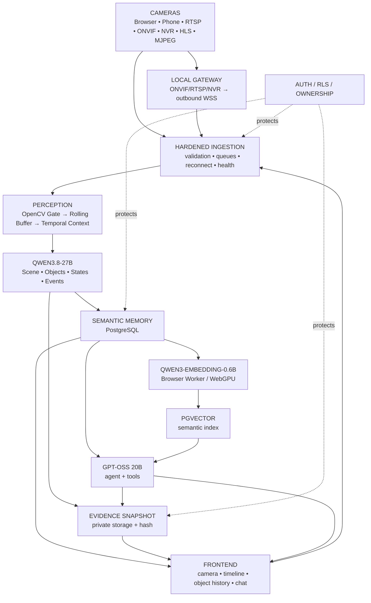

---

## Vistara

> **See it. Remember it. Ask later.**
