# Vistara — Backend & System Architecture

> **Vistara** turns live camera feeds into searchable visual memories you can talk to.
>
> The system observes cameras continuously, but invokes expensive vision reasoning only when the local perception gate detects meaningful change. It converts those observations into structured scene, object, state, event, and evidence records that can later be retrieved through natural language.

This document is the **current architecture source of truth** for the backend. The frontend is a separate application and should integrate against the frozen API/WebSocket contracts in `docs/FRONTEND_PLAN.md`.

---

## 1. Product Definition

### One-line pitch

> **Vistara remembers what cameras see, so you can ask what happened later.**

### Core loop

```text
CAMERA
  ↓
MEANINGFUL CHANGE
  ↓
MULTI-FRAME VISUAL OBSERVATION
  ↓
SEMANTIC MEMORY
  ↓
NATURAL-LANGUAGE RETRIEVAL
  ↓
ANSWER + VISUAL EVIDENCE
```

Vistara is **not** a continuous video-archive-first system. Its primary memory is semantic. Raw frames are used as visual context and selected evidence; the searchable knowledge layer is built from structured observations.

---

## 2. Locked Architecture

| Layer | Technology / Decision |
|---|---|
| Backend | **Python 3.12, FastAPI, Pydantic, asyncio, WebSockets** |
| Visual model | **Qwen3.8-27B via Groq** — `qwen/qwen3.8-27b` |
| Chat / agent | **GPT-OSS 20B via Groq** — `openai/gpt-oss-20b` |
| Embeddings | **Qwen3-Embedding-0.6B**, client-side via Transformers.js + ONNX + WebGPU |
| Local perception gate | **OpenCV**, frame-difference + persistence + cooldown; optional SSIM |
| Database | **Supabase PostgreSQL + pgvector** |
| Authentication | **Supabase Auth + backend JWT validation** |
| Evidence storage | **Private Supabase Storage bucket** in production; local-disk fallback for development |
| Transport | HTTPS / WSS |
| Camera gateway | Local outbound-only gateway for RTSP/ONVIF/NVR/LAN sources |
| Frame memory | Rolling temporal buffer + bounded per-camera queues |
| RAG | Hybrid structured retrieval + metadata/time filters + pgvector similarity |

### Explicitly out of the locked architecture

No Ollama, no local VLM, no Firestore, no Redis/Celery/Kafka, no Qdrant/Pinecone, and **no FastVLM-0.5B in the MVP**.

FastVLM was considered as a second local VLM, but the architecture deliberately stays lean: **multi-frame contextual input to Qwen3.8-27B is the chosen perception-quality strategy**.

---

## 3. Complete System Architecture

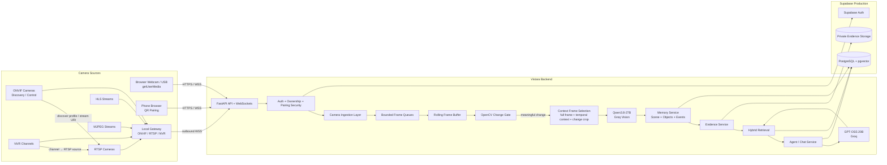

---

## 4. Camera Connectivity Architecture

Vistara treats camera connectivity as a **source-adapter problem**, not a separate pipeline per camera type.

Every source eventually produces one normalized internal frame representation.

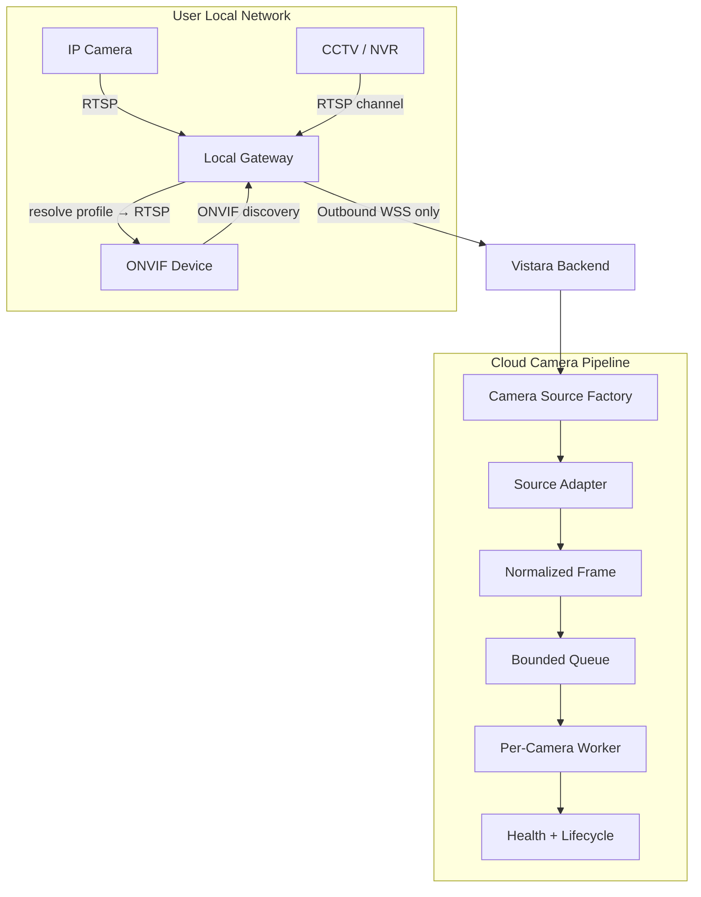

### Supported source model

- `browser` — browser webcam / external USB camera through `getUserMedia()`
- `phone` — phone browser camera using short-lived QR pairing
- `rtsp` — network camera / CCTV / NVR media stream
- `hls` — HLS media stream
- `mjpeg` — multipart JPEG stream
- `gateway` — normalized frames coming from a local outbound gateway

### ONVIF rule

ONVIF is treated primarily as **discovery and control**. It discovers the device, capabilities, media profile, and stream URI; actual frame ingestion is handled through the resulting media source, commonly RTSP.

### NVR rule

Each NVR channel becomes an independent logical camera source:

```text
NVR
├── Channel 1 → RTSP → Camera ID A
├── Channel 2 → RTSP → Camera ID B
├── Channel 3 → RTSP → Camera ID C
└── ...
```

This keeps health, workers, events, and memory ownership independent per camera.

---

## 5. Camera Reliability Model

Every camera has an explicit lifecycle:

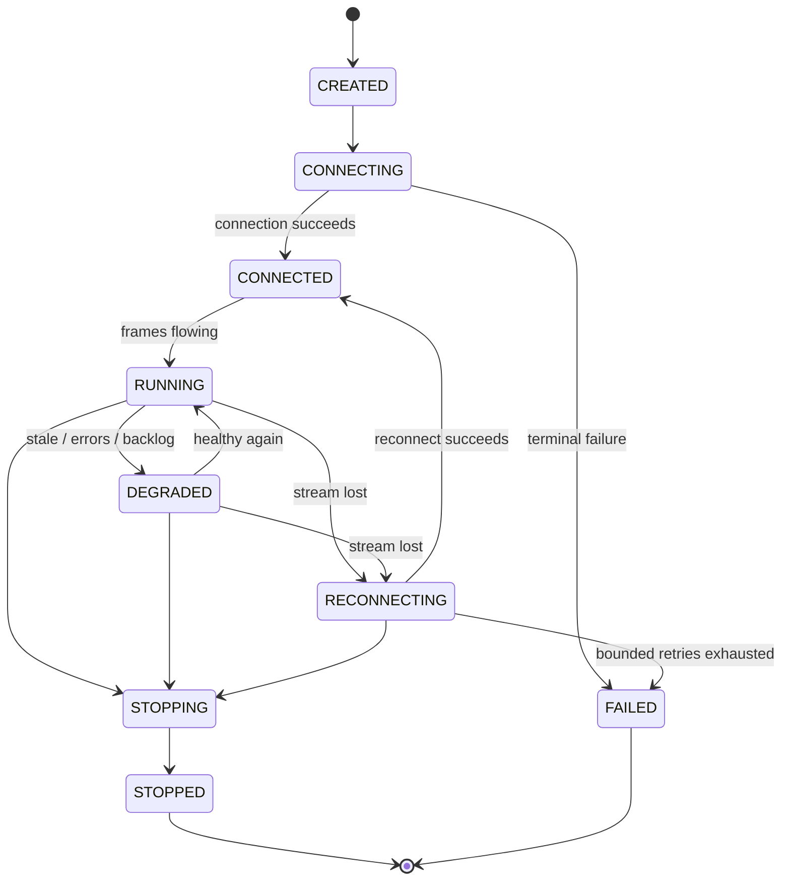

### Reliability properties

- per-camera worker isolation
- bounded frame queues
- drop-oldest behavior under sustained pressure
- counted dropped frames
- stale-frame detection
- bounded exponential reconnect with jitter
- reconnect backoff reset after successful recovery
- graceful FFmpeg process cleanup
- structured camera lifecycle logs
- one broken camera cannot terminate the whole camera manager

### Health is not just socket state

A camera that has an open TCP connection but has produced no frame for N seconds is **not healthy**.

Health therefore tracks:

- lifecycle state
- last frame timestamp
- last successful decode/read
- reconnect attempts
- frames received
- frames dropped
- last error
- source type

---

## 6. Browser + Phone Connectivity

### Browser camera

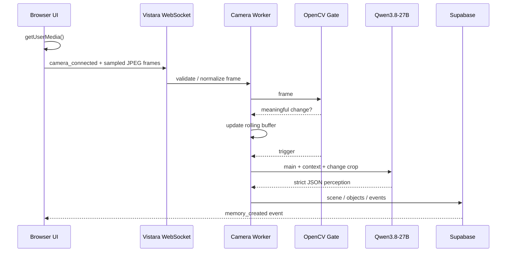

### Phone pairing

Phone pairing is browser-based and intentionally avoids a native mobile application for the MVP.

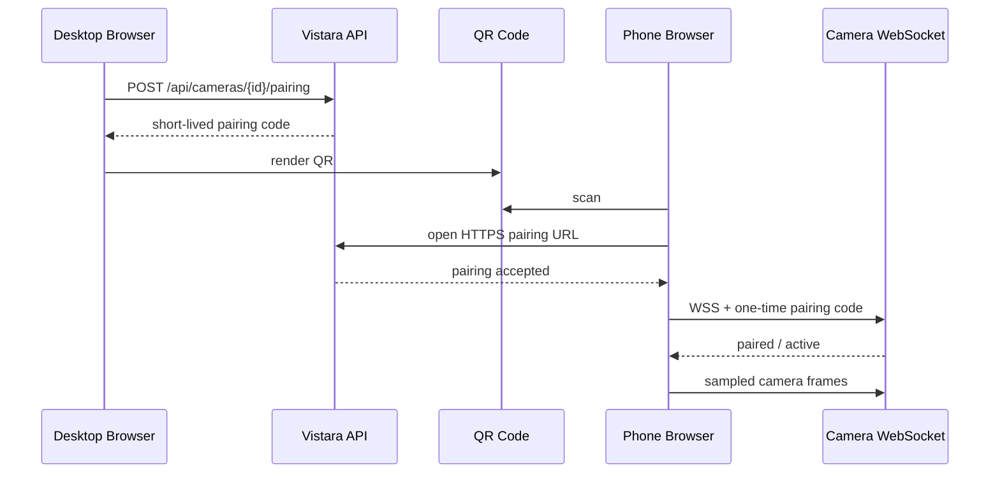

Pairing codes are:

- short-lived
- camera-scoped
- user-scoped
- single-use / replay-safe
- revocable

No long-lived secret is embedded in the QR code.

---

## 7. Perception Pipeline — The Important Part

### Core rule

**Do not send one isolated trigger frame to the VLM.**

Vistara uses temporal context.

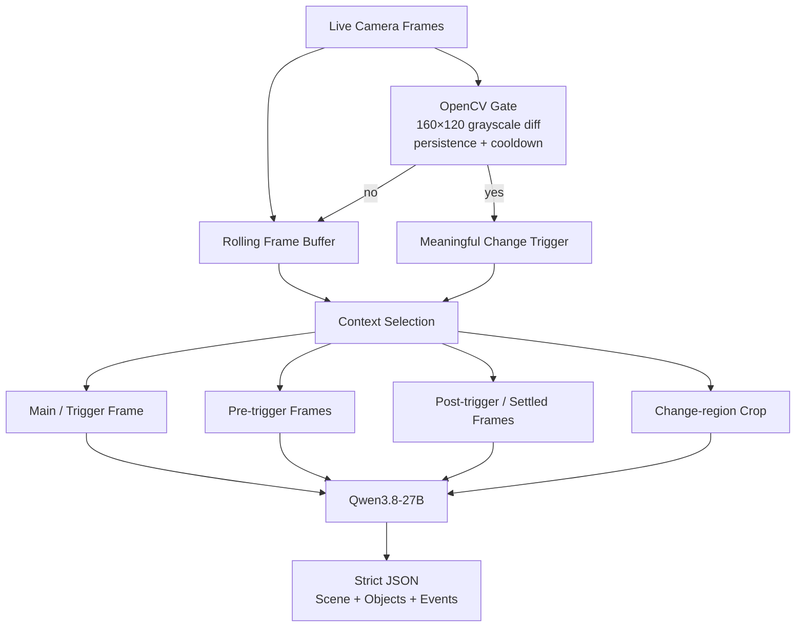

### Example temporal context

```text
BEFORE                 TRIGGER                AFTER
──────────             ───────                ─────
frame -3s              changed frame          frame +1s
frame -2s              event frame            frame +2s
frame -1s              main frame             settled state
```

This allows the VLM to reason about:

- what was present before
- what appeared
- what disappeared
- what moved
- what changed state
- what is merely occluded

### Why no FastVLM

A second VLM was considered to improve visual recall, but it would add:

- another model download
- additional WebGPU memory pressure
- another inference pipeline
- additional latency and failure modes

For the MVP, the preferred quality lever is **better temporal evidence + targeted crops**, not another model.

---

## 8. Qwen3.8-27B — The Visual Authority

Model:

`qwen/qwen3.8-27b` via Groq.

Role:

> **The eyes of Vistara.**

It receives contextual images and produces structured semantic perception.

### Three outputs

#### A. Overall scene

- scene type
- concise summary
- activity
- environment

#### B. Granular object/state perception

- object category / identity when supported
- description
- attributes
- color when visually supported
- state
- approximate location
- relationships
- confidence

#### C. Event / delta perception

Primary MVP events:

- `OBJECT_APPEARED`
- `OBJECT_DISAPPEARED`
- `OBJECT_MOVED`
- `SCENE_CHANGED`
- activity changes when supported

### Important semantic rule

**Missing attribute is better than fabricated attribute.**

For example:

```json
{
  "label": "bottle",
  "attributes": {
    "color": "blue",
    "material": "plastic"
  }
}
```

Only include attributes that the model can visually support.

### Completeness strategy

Qwen is prompted to perform a **visual inventory**, not merely a generic description:

1. scan the entire frame set
2. inventory distinct useful objects
3. record visually supported attributes
4. perform a second pass for small/partially occluded objects
5. compare temporal frames for changes
6. never invent unsupported attributes

---

## 9. Memory Model

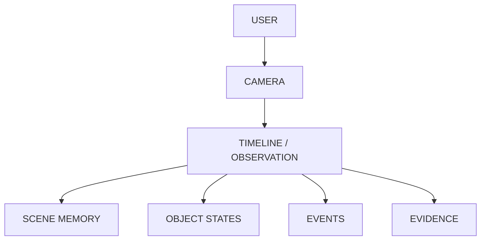

### Example object history

```text
ESP32

10:41  → center of desk
10:43  → beside laptop
10:47  → right side of desk
11:02  → last observed
```

“Last observed” is deliberately used instead of claiming that the object was definitely removed after the final observation. Occlusion and missed observations are possible.

### Source of truth vs index

```text
PostgreSQL structured memory
        ↑
    SOURCE OF TRUTH

pgvector embedding
        ↑
      SEARCH INDEX
```

Embeddings are not the memory itself.

---

## 10. Embeddings

The embedding model is:

**Qwen3-Embedding-0.6B**

Runtime:

- Transformers.js
- ONNX
- WebGPU
- Web Worker

### Important separation

Embeddings are generated for:

- semantic memory text
- user queries

They are **not** generated for raw video frames.

### Flow

```mermaid
flowchart LR
    M[Memory Created]
    TXT[Retrieval-Oriented Memory Text]
    W[Browser Web Worker]
    E[Qwen3-Embedding-0.6B]
    V[1024-D Vector]
    API[POST /api/memories/{id}/embedding]
    DB[(pgvector)]

    M --> TXT
    TXT --> W
    W --> E
    E --> V
    V --> API
    API --> DB
```

Memory persistence should not wait for embedding generation.

If WebGPU is unavailable, exact/metadata/temporal retrieval still needs to work without vector similarity.

---

## 11. Retrieval Architecture

Vistara uses hybrid retrieval:

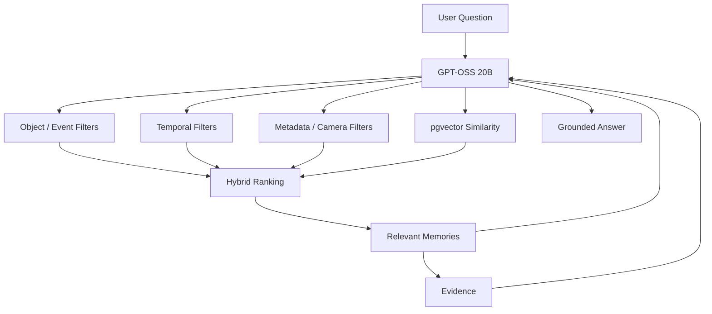

### Why hybrid retrieval

Exact questions often need SQL rather than embeddings.

Examples:

- “What changed in the last minute?” → temporal/event filtering
- “Where was the ESP32?” → object history
- “That little development board” → semantic similarity may help map language to stored observations

---

## 12. GPT-OSS 20B — The Reasoning / Chat Layer

Model:

`openai/gpt-oss-20b` via Groq.

Role:

> **The brain of Vistara.**

GPT-OSS does not receive the complete live camera feed. It receives user questions and calls retrieval tools.

### Agent loop

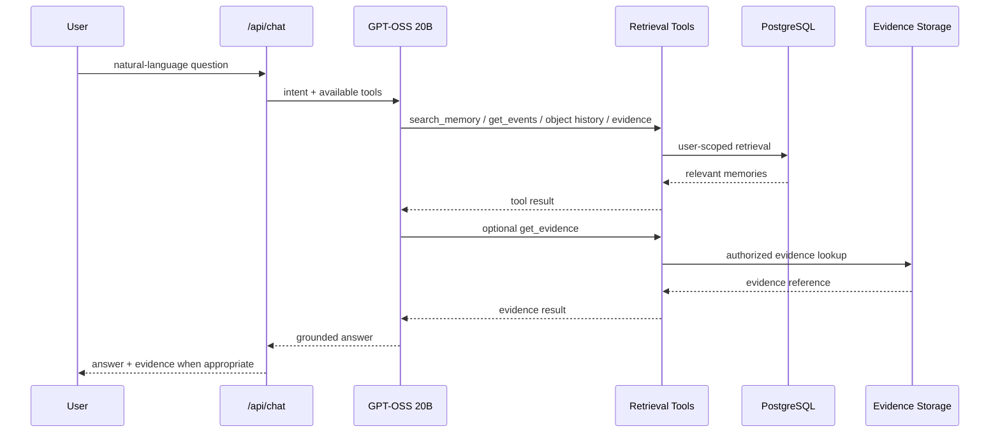

The backend remains authoritative for tool execution and user scoping.

---

## 13. Evidence Model — Visual Proof Without Becoming a Forensics Platform

Vistara should preserve a visual evidence snapshot for meaningful memories/events.

However, the product must **not** claim forensic chain-of-custody guarantees unless a separate forensic system is built.

### Recommended evidence model

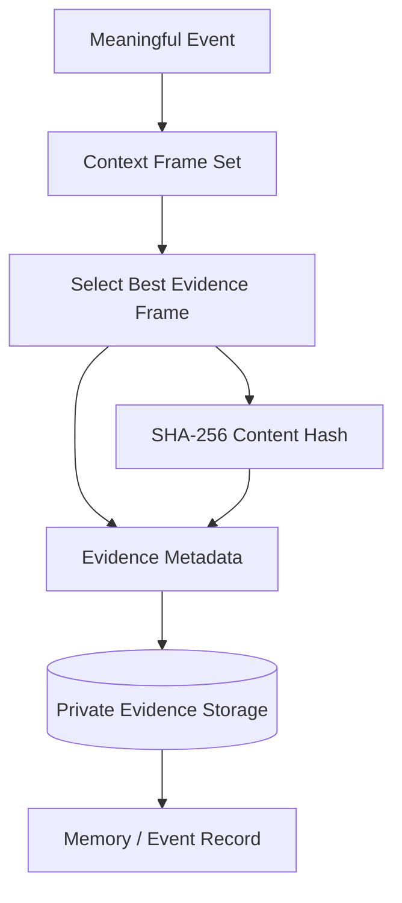

### Store

- event / memory association
- camera ID
- capture timestamp
- frame sequence where available
- dimensions / encoding metadata
- SHA-256 content hash
- private storage path
- signed URL only when authorized

### Do not promise

Do **not** describe this as:

- immutable forensic evidence
- cryptographic chain of custody
- proof of an event

The correct product language is:

> **“A visual evidence snapshot associated with the memory.”**

The hash provides integrity checking for the stored bytes; it does not by itself establish a legal chain of custody.

---

## 14. Security Architecture

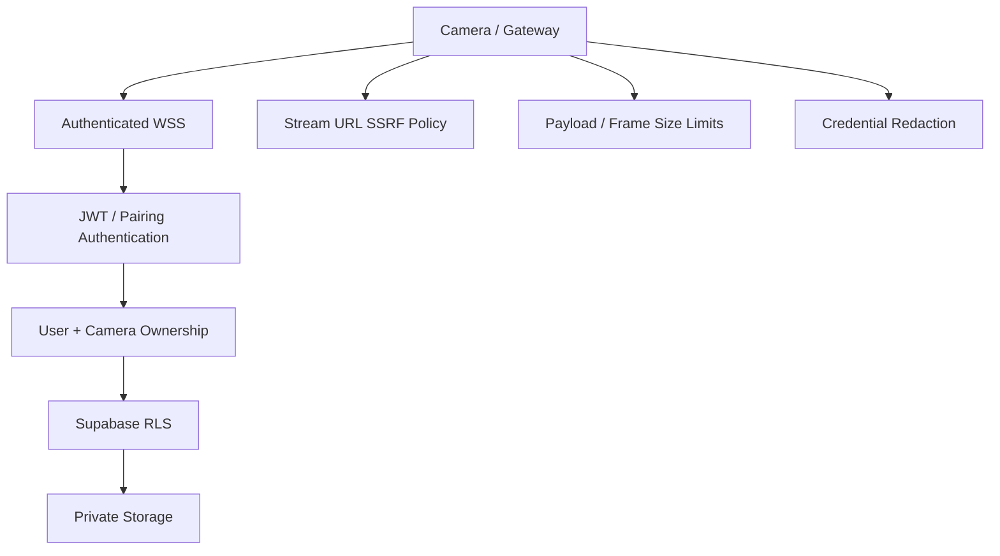

### Camera URL security

User-controlled RTSP/HLS URLs are untrusted input.

Default policy:

- reject loopback/private/metadata targets
- allow private LAN targets only when explicitly enabled for self-hosted camera deployments
- never expose credential-bearing URLs in logs or API responses

Configuration gate:

`CAMERAS_ALLOW_PRIVATE_NETWORKS=true`

### Other security properties

- JWT validation fails closed
- user-scoped repositories
- database RLS in production
- private evidence bucket
- short-lived pairing codes
- replay-safe pairing
- bounded frame sizes
- structured logs with secrets redacted

---

## 15. Reliability & Backpressure

Vistara is not a video archive. It must remain stable even when incoming camera FPS exceeds processing capacity.

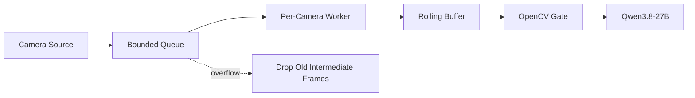

### Principles

- queues are bounded
- newest useful frames are preferred
- dropped frames are counted
- no unbounded RAM growth
- VLM invocation is event-driven
- camera failures are isolated
- shutdown is graceful

---

## 16. API / WebSocket Contract Summary

### REST

The backend currently exposes the frozen contract documented in `docs/FRONTEND_PLAN.md`.

Core domains:

- health
- cameras
- memories
- objects / object history
- events
- chat
- evidence
- ingestion / pairing / gateway / discovery where applicable

### WebSocket camera flow

Client → server:

```json
{"type":"camera_connected"}
{"type":"frame","data":"<base64 jpeg>","ts":1730000000000}
{"type":"stop"}
```

Server → client:

```json
{"type":"connection_state","state":"connected"}
{"type":"processing","state":"analyzing"}
{"type":"change_detected","score":0.031}
{"type":"memory_created","memory_id":"...","summary":"...","events":[]}
{"type":"error","message":"..."}
```

Frames are not streamed back to the browser; the browser owns its own preview.

---

## 17. End-to-End Event Lifecycle

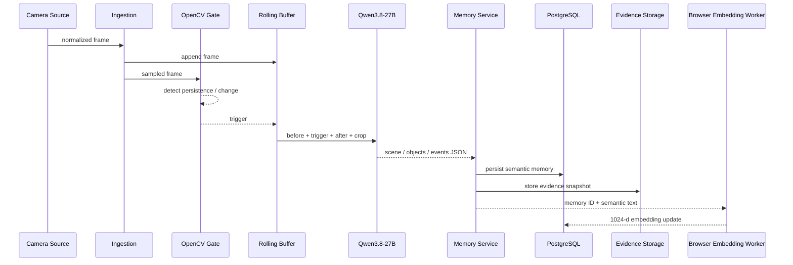

---

## 18. Current Verification State

The backend has been independently tested against mocks/local infrastructure and the live Groq providers.

### Verified

- Qwen3.8-27B live provider
- GPT-OSS 20B live provider
- GPT-OSS tool selection
- full chat → tool → retrieval → grounded answer loop
- OpenCV gate
- rolling contextual frame handling
- memory creation
- user-scoped backend authorization
- WebSocket flow over real TCP
- local evidence fallback
- offline test suite

### Production verification caveat

The architecture requires a real Supabase project for final verification of:

- PostgreSQL
- pgvector
- Auth
- database-side RLS evaluation
- private Storage
- signed evidence URLs
- full Supabase-backed end-to-end flow

When those credentials are unavailable, local SQLite/mock paths are development fallbacks and must never be described as production verification.

### Groq operational caveat

Free-tier Groq OTPM can make large structured VLM responses flaky. The current provider therefore keeps the perception output concise. The application must also tolerate latency and 429 responses.

---

## 19. Repository Architecture

```text
backend/app/
├── api/
│   ├── health
│   ├── cameras
│   ├── memories
│   ├── objects
│   ├── events
│   ├── chat
│   ├── evidence
│   ├── ws
│   ├── ingest
│   ├── pairing
│   ├── gateway
│   └── discovery
│
├── core/
│   ├── config.py
│   ├── security.py
│   └── logging.py
│
├── db/
│   ├── models.py
│   ├── repositories.py
│   └── session.py
│
├── cameras/
│   ├── base.py
│   ├── factory.py
│   ├── frames.py
│   ├── security.py
│   ├── reconnect.py
│   ├── pull.py
│   ├── ffmpeg_reader.py
│   ├── rtsp.py
│   ├── hls.py
│   ├── mjpeg.py
│   ├── onvif.py
│   ├── nvr.py
│   ├── pairing.py
│   ├── gateway.py
│   └── manager.py
│
├── perception/
│   ├── gate.py
│   ├── buffer.py
│   ├── pipeline.py
│   └── image_utils.py
│
├── providers/
│   ├── vision.py
│   ├── groq_qwen38.py
│   ├── chat.py
│   ├── groq_gptoss.py
│   └── mock.py
│
├── memory/
│   ├── schemas.py
│   ├── service.py
│   ├── normalization.py
│   └── serialize.py
│
├── retrieval/
│   ├── service.py
│   └── hybrid.py
│
├── agent/
│   ├── service.py
│   ├── tools.py
│   └── prompts.py
│
├── evidence/
│   └── service.py
│
└── workers/
    ├── camera_worker.py
    └── embedding.py

supabase/
└── migrations/
    └── 0001_init.sql

docs/
└── FRONTEND_PLAN.md
```

---

## 20. Design Principles

### 1. Semantic memory first

The value is not storing hours of video. The value is turning relevant visual events into structured, searchable memory.

### 2. Evidence is attached to memory

A user should be able to move from:

```text
Question → Memory → Event → Visual Evidence
```

### 3. Temporal context beats blind frame frequency

More frames are not automatically better. The system should capture **useful temporal diversity** around meaningful changes.

### 4. The large VLM is authoritative

Small/local preprocessing may guide the system, but the MVP does not introduce another VLM. Qwen3.8-27B is the authoritative semantic perception model.

### 5. Models are separated by role

```text
Qwen3.8-27B       = visual perception
Qwen3-Embedding   = semantic index
GPT-OSS 20B       = language + tool reasoning
OpenCV            = cheap local change detection
```

### 6. Structured truth + vector search

PostgreSQL stores the semantic truth. pgvector is an index that makes fuzzy retrieval useful.

### 7. Security before convenience

Camera credentials, pairing tokens, evidence, and cross-user data must never be casually exposed for the sake of a smoother demo.

### 8. No fake verification

A mocked SQLite test can prove application logic. It cannot prove Supabase RLS or Storage.

---

## 21. What Vistara Is Not

Vistara is **not**:

- a 24/7 raw CCTV archive by default
- a legal forensic evidence platform
- a face-recognition identity system
- a continuous VLM inference loop
- a generic chatbot with a camera attached
- a second-VLM ensemble in the MVP

It is a **camera-to-memory system**.

---

## 22. Hackathon Demo Narrative

The strongest controlled demo is a small desk scene containing several distinct objects.

```text
CAMERA WATCHES
      ↓
move ESP32 / phone / bottle
      ↓
OpenCV notices meaningful change
      ↓
Vistara sends multi-frame context to Qwen
      ↓
memory + event + evidence snapshot created
      ↓
ask:
"Where was the ESP32 before I moved it?"
      ↓
GPT-OSS retrieves object history
      ↓
answer
      ↓
"Show me."
      ↓
evidence snapshot
```

The product story is:

> **The camera saw it. Vistara remembered it. You can ask later.**

---

## 23. Final Architecture at a Glance

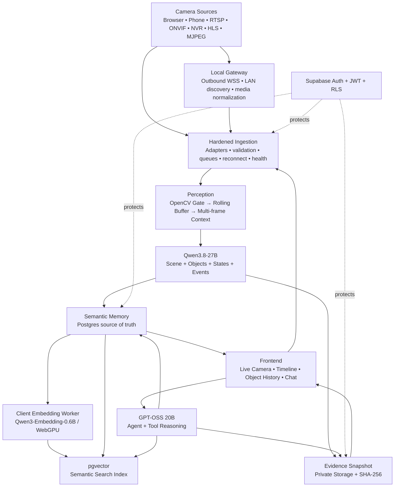

---

## 24. Final Status

### Backend

**Locked with minor production-verification caveats.**

### Camera architecture

**Designed around real multi-source ingestion, isolation, reconnection, health, and secure gateway connectivity.**

### Perception

**Multi-frame Qwen3.8-27B is the selected quality strategy; no second VLM.**

### Retrieval

**Hybrid structured + vector retrieval, scoped to the authenticated user.**

### Evidence

**Event-linked visual snapshots are supported as product evidence, with optional SHA-256 integrity metadata; no forensic chain-of-custody claim.**

### Frontend

The frontend remains a separate application owned by the frontend team. It consumes the frozen REST and WebSocket contracts.

---

## 25. Golden Rules for Future Changes

1. **Do not add another model unless a measured failure justifies it.**
2. **Prefer better temporal evidence over more model complexity.**
3. **Never turn semantic memory into a raw video archive by accident.**
4. **Never call a mocked integration “production verified.”**
5. **Every camera source must normalize into the same processing pipeline.**
6. **Every user-owned object must remain user-scoped.**
7. **Evidence is evidence of what the camera supplied, not proof of the model's interpretation.**
8. **The backend must stay boring and reliable so the intelligence can stay useful.**

---

**Vistara**  
*See it. Remember it. Ask later.*
